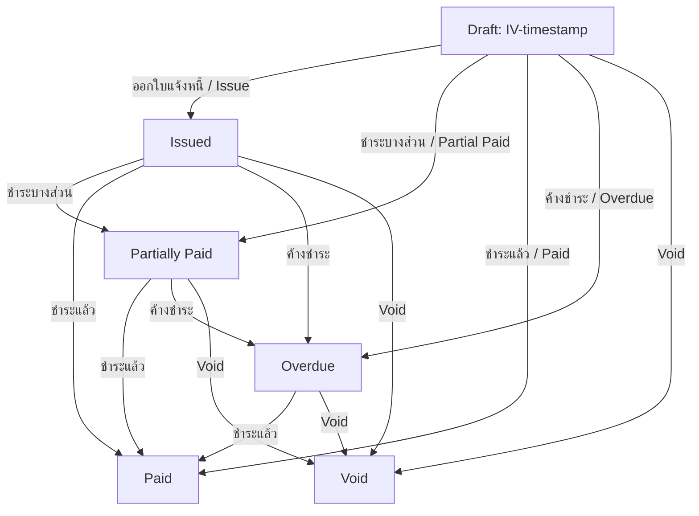

# ระบบจัดทำเอกสารด่วนและการไหลเวียนงาน (Easy Document Workflow Guide)

คู่มือฉบับนี้สรุปโครงสร้างสถาปัตยกรรม การคำนวณภาษี ขั้นตอนการทำงาน และกฎของระบบ **Easy Documents (ระบบตัวช่วยสร้างใบเสนอราคาและใบแจ้งหนี้ด่วน)** ภายในแผงควบคุมระบบของ Supernumber

---

## 1. ภาพรวมระบบ (Overview)

ระบบ Easy Documents ได้รับการออกแบบขึ้นมาเพื่อความกระชับ รวดเร็ว และลดขั้นตอนการกรอกข้อมูลที่มากเกินไปในระบบ Editor เดิม โดยยุบรวมจากขั้นตอนเดิม 4 ขั้นตอน เหลือเพียง **3 ขั้นตอนหลัก (3-Step Wizard)** พร้อมความสามารถในการพรีวิวผลลัพธ์จำลองที่ตรงตามรูปแบบจริง 100% ก่อนกดยืนยัน

---

## 2. ขั้นตอนการสร้างเอกสารด่วน (The 3-Step Wizard Flow)

หน้าต่างสร้างเอกสารด่วนจะแบ่งขั้นตอนการทำงานหลักออกเป็น 3 ขั้นตอนดังนี้:

### ขั้นตอนที่ 1: การกำหนดลูกค้า / ข้อมูลอ้างอิง (Customer & Reference Selection)
* **สำหรับใบเสนอราคา (Quotation):**
  * เลือกลูกค้าเก่าจากระบบได้ทันทีผ่าน Dropdown list
  * มีปุ่มเปิดใช้งานฟอร์ม **สร้างลูกค้าใหม่แบบด่วน (Quick Customer Creation Form)** ในหน้าต่างเดียวกัน (Inline) แบบมีขอบประสวยงาม โดยกรอกรายละเอียดพื้นฐาน (ชื่อบริษัท/ลูกค้า, ชื่อผู้ติดต่อ, เบอร์โทรศัพท์, อีเมล, เลขผู้เสียภาษี และที่อยู่) เมื่อบันทึกสำเร็จจะ auto-select ลูกค้าคนใหม่ให้ทันทีโดยไม่ต้องโหลดหน้าจอใหม่
* **สำหรับใบแจ้งหนี้ (Invoice):**
  * ค้นหาใบเสนอราคาอ้างอิงได้ผ่านช่องพิมพ์ค้นหาด่วน (Search Box) โดยตัวเลือกจะโหลดข้อมูลเลขที่เอกสาร, ชื่อลูกค้า และยอดเงินมาให้เลือก เมื่อคลิกเลือก ใบแจ้งหนี้จะดึงข้อมูลลูกค้า รายการบริการ และวิธีการคำนวณทั้งหมดจากใบเสนอราคามาให้แบบอัตโนมัติ

### ขั้นตอนที่ 2: เพิ่มรายการบริการและเงื่อนไขการชำระเงิน (Items & Payment Settings)
* **เพิ่มบริการ (Add Items):** เพิ่มรายการ ชื่อบริการ/สินค้า, ราคา และจำนวน เพื่อคำนวณราคาแบบเรียลไทม์
* **เลือกวิธีกำหนดราคา (Calculation Method):** เลือกระหว่าง
  1. *Standard - Set Base Price:* คำนวณราคาเริ่มต้นก่อน VAT
  2. *Reverse - Set Target Income:* คำนวณราคากลับจากรายได้เป้าหมายหลังหักภาษี ณ ที่จ่าย 3%
* **การคำนวณและแสดงตารางราคา (Price Breakdown Table):**
  * ระบบจะกู้คืนและแสดงแผงสรุปยอดราคาสองภาษาสมบูรณ์แบบ (`Sub Total`, `Vat 7%`, `Grand Total`, `Withheld Tax 3%`, `Net to Pay`)
  * หากเลือกโหมด **Reverse** จะแสดงแถวพิเศษ **"รายได้เป้าหมาย / Target Income"** เพิ่มเติมเข้ามาในแผงรายละเอียด เพื่อความโปร่งใสสูงสุดในการคำนวณ
* **วิธีการชำระเงินและเงื่อนไข (Payment Options Side-by-Side):**
  * ย้ายส่วนเลือกวิธีการชำระเงิน (Payment Method: ธนาคาร / QR / เงินสด) และเงื่อนไขการชำระเงิน (Payment Term: ทั้งหมด / แบ่งงวด / กำหนดวัน) ขึ้นมาอยู่ด้วยกันด้านล่างสุดของขั้นตอนนี้
  * **Layout ระดับพรีเมียม:** จัดวางกล่องเลือกทั้งสองส่วนแบบคู่ขนานกัน **(2-Column CSS Grid)** บนเดสก์ท็อป เพื่อความสวยงาม กระชับสายตา และไม่ทิ้งช่องว่างสีขาวว่างเปล่าทับซ้อน

### ขั้นตอนที่ 3: สรุปก่อนสร้างสมจริง (Simulated Preview PDF Mockup)
* จำลองภาพรวมของใบเอกสารต้นแบบที่จะพิมพ์จริงลงในกรอบการ์ดจำลองพรีเมียม (Premium Card Mockup)
* แสดงผลข้อมูลจริงทั้งหมด ได้แก่ โลโก้แบรนด์, เลขที่เอกสารจำลอง, ชื่อบริษัท, รายชื่อลูกค้าและผู้ติดต่อ, ตารางรายการสินค้าจำลอง, เงื่อนไขการชำระเงิน
* แสดงสัดส่วนตารางแจกแจงราคาสองภาษาตรงตามใบพิมพ์จริง พร้อมกล่องไฮไลท์กรอบสีเขียวชำระเงินสุทธิ (**Net to Pay**)
* กดยืนยันปุ่ม **"สร้างเอกสาร ✓"** เพื่อประมวลผลเซฟลงฐานข้อมูล

---

## 3. รูปแบบเลขที่เอกสารจำลอง (Document Numbering Strategy)

เพื่อแก้ปัญหาเลขที่เอกสารดราฟต์ที่ดูสับสนและซ้ำซ้อน ระบบได้นำคำว่า `DRAFT` ออกจากรหัสหลักทั้งหมด และแทนที่ด้วยรหัสตามจริงของประเภทเอกสารนั้นๆ เพื่อความเรียบร้อยและง่ายต่อการคัดแยก:

* **ใบเสนอราคาฉบับร่าง (Quotation Draft):**
  * รูปแบบรหัส: `QT-YYYYMMDDHHMMSS` (เช่น `QT-20260523190652`)
* **ใบแจ้งหนี้ฉบับร่าง (Invoice Draft):**
  * รูปแบบรหัส: `IV-YYYYMMDDHHMMSS` (เช่น `IV-20260523190652`)
* **การตั้งชื่อไฟล์ PDF ดราฟต์:** จะถูกตั้งชื่อล้อตามรหัสตัวพิมพ์เล็ก เช่น `qt-20260523190652.pdf` และ `iv-20260523190652.pdf`

---

## 4. กฎการไหลเวียนและเปลี่ยนสถานะเอกสาร (Document Workflow States)

### 4.1 การเปลี่ยนสถานะใบแจ้งหนี้ (Invoice Status Transitions)
ใบแจ้งหนี้ที่อยู่ในขั้นตอนเริ่มต้นหรือดราฟต์ สามารถเปลี่ยนผ่านสถานะได้อย่างอิสระผ่านเมนู "จัดการ" บนตาราง โดยผ่านการดูแลของ `app/Services/InvoiceService.php` ดังนี้:



> [!IMPORTANT]
> **การควบคุมสถานะในฐานข้อมูล:** ทุกครั้งที่มีการคลิกอัปเดตเปลี่ยนสถานะเอกสารดราฟต์ผ่านตารางแผงควบคุมระบบ (Workflow Actions) ระบบจะทำการตั้งค่าฟิลด์ `is_draft = false` ให้ทันทีโดยอัตโนมัติ เพื่อให้ระบบหลังบ้านและเงื่อนไขการกรองข้อมูลบันทึกยอดชำระเงินทำงานได้อย่างแม่นยำ 100%

### 4.2 การเปลี่ยนสถานะใบเสนอราคา (Quotation Status Transitions)
การเปลี่ยนสถานะใบเสนอราคาผ่าน `app/Services/QuotationService.php` มีระบบดังนี้:
* **ส่งใบเสนอราคา (Send):** อัปเดตสถานะเป็น `sent` และเปลี่ยน `is_draft = false`
* **ยอมรับ (Accept):** อัปเดตสถานะเป็น `accepted` และเปลี่ยน `is_draft = false`
* **ปฏิเสธ (Reject):** อัปเดตสถานะเป็น `rejected` และเปลี่ยน `is_draft = false`
* **หมดอายุ (Expire):** อัปเดตสถานะเป็น `expired` และเปลี่ยน `is_draft = false`
* **ยกเลิก (Cancel):** อัปเดตสถานะเป็น `cancelled` และเปลี่ยน `is_draft = false`
* **แปลงเป็นใบแจ้งหนี้ (Convert to Invoice):** ใบเสนอราคาที่มีสถานะ `accepted` สามารถกดแปลงเป็นใบแจ้งหนี้ดึงข้อมูลไปเป็นตัวจริงในตาราง IV ได้ทันที

---

## 5. การปรับปรุง UI/UX ระดับพรีเมียม (Premium Frontend Implementation)

### 5.1 การปิดตัวช่วยสร้างทันทีและดึงข้อมูลใหม่ (Instant Refresh Callback)
เมื่อกดยืนยันสร้างเอกสารสำเร็จในขั้นตอนที่ 3:
1. ตัวช่วยสร้าง (Modal) จะถูกปิดตัวลงทันทีอย่างลื่นไหล
2. ระบบจะทำการ Redirect หน้าจอหลักไปยังรายการของประเภทเอกสารนั้นๆ โดยทันทีผ่าน `window.location.href = '/admin/saved-sales-documents?type=[quotation|invoice]'`
3. เอกสารใหม่ที่เพิ่งสร้างเสร็จจะปรากฏเด่นอยู่ทาง **แถวบนสุดของตารางทันที** ทำให้การทำงานต่อเนื่องไม่มีสะดุด

### 5.2 การแก้ไข Dropdown ปุ่มจัดการโดนขลิบตัดทับซ้อน (Table Overflow Solution)
* **ปัญหาเดิม:** การ์ดตารางแอดมิน `.admin-table-card` และตัวครอบตาราง `.admin-table-wrap` มีคำสั่ง `overflow: hidden;` และ `overflow-x: auto;` บังคับอยู่ เพื่อรองรับสกรอลล์แถวแนวนอนในมือถือ ทำให้เมื่อแถวสุดท้ายคลิกเปิดปุ่ม "จัดการ" กล่องตัวเลือก Dropdown จะโดนกรอบขอบล่างตัดขาดหายไป หรือเกิดช่องว่างโล่งใต้ตารางขนาดใหญ่หากไปใส่ padding-bottom ถาวร
* **การแก้ไขด้วย CSS ระดับพรีเมียม:**
  * นำ inline padding ว่างๆ ออก เพื่อให้ภาพรวมรูปทรงการ์ดสั้นพอดีสวยงาม
  * เขียน CSS Media Query ตรวจจับการใช้งานบนคอมพิวเตอร์เดสก์ท็อป (`@media (min-width: 1024px)`) บังคับให้ส่วนครอบขอบตารางเป็นอิสระ:
    ```css
    @media (min-width: 1024px) {
      .admin-table-card {
        overflow: visible !important;
      }
      .admin-table-wrap {
        overflow: visible !important;
      }
    }
    ```
  * **ผลลัพธ์:** เมื่อเข้าผ่าน Desktop ตัวกล่องปุ่มเมนู "จัดการ" จะสามารถลอยทับซ้อนทะลุขอบเขตล่างของตารางและขอบของการ์ดขาวลงมาได้อย่างอิสระสวยงาม โดยไม่มีความแปลกตาของพื้นที่ว่างสีขาวใต้ตาราง และบนหน้าจอมือถือก็ยังคงความสามารถในการสกรอลล์แนวนอนและตอบสนองต่อผู้ใช้งานได้อย่างเต็มที่

---

## 6. ตำแหน่งไฟล์สำคัญสำหรับนักพัฒนา (Developer References)

* **ส่วนติดต่อผู้ใช้งาน (Blade View & JS Controller):**
  * [sales-documents-index.blade.php](file:///Users/efaum/Sites/localhost/Supernumber/resources/views/admin/sales-documents-index.blade.php) - หน้าตารางเอกสาร, ตัวช่วยสร้าง Easy Documents 3 ขั้นตอนด่วน, ฟอร์มสร้างลูกค้า Inline ด่วน, และ CSS/JS ควบคุมการคำนวณทั้งหมด
* **การจัดการเส้นทางและ API (Routes & Creation Endpoints):**
  * [routes/web.php](file:///Users/efaum/Sites/localhost/Supernumber/routes/web.php) - รวบรวม Route จัดการสถานะ, บันทึกฉบับร่าง และ API จัดทำเอกสารด่วน `/admin/easy-documents/create` รวมถึงตรรกะการคุมแปลงและสร้างรหัสต้นทาง
* **ระบบจัดการความถูกต้องหลังบ้าน (Business Logic & Workflow Services):**
  * [QuotationService.php](file:///Users/efaum/Sites/localhost/Supernumber/app/Services/QuotationService.php) - คุมสถานะและการแปลงใบเสนอราคาเป็นใบแจ้งหนี้
  * [InvoiceService.php](file:///Users/efaum/Sites/localhost/Supernumber/app/Services/InvoiceService.php) - คุมการเปลี่ยนสถานะของใบแจ้งหนี้ดราฟต์ไปยังสถานะพร้อมชำระ
* **ระบบทดสอบความเสถียร (Verification Specs):**
  * [AdminEasyDocumentTest.php](file:///Users/efaum/Sites/localhost/Supernumber/tests/Feature/AdminEasyDocumentTest.php) - เคสทดสอบประเมินความถูกต้องของผลลัพธ์คำนวณ Standard, Reverse และการแนบเลขอ้างอิงของระบบช่วยสร้างด่วน
  * [AdminSavedSalesDocumentTest.php](file:///Users/efaum/Sites/localhost/Supernumber/tests/Feature/AdminSavedSalesDocumentTest.php) - เคสทดสอบพฤติกรรม workflow และสิทธิ์การเข้าถึงปุ่มจัดการสถานะบนตารางหลัก
